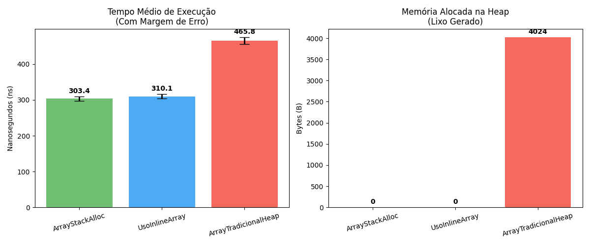

# Inline arrays no c# - alocando arrays na stack

Antes do c# 12, para criar um array na stack era preciso usar o stackalloc:

```csharp
Span<int> array = stackalloc int[10];
```

Com o c# 12, é possível criar um array na stack usando uma annotation em uma struct

```csharp
[InlineArray(10)]
public struct MeuArrayNaStack
{
    private int _elemento; 
}
```

para usar:

```csharp
MeuArrayNaStack array = new MeuArrayNaStack();

for (int i = 0; i < 10; i++)
{
    array[i] = i * 2;
}
```


## Examinando o IL gerado (apenas pontos relevantes)

### Na alocação tracional, que acontece na heap, temos:

```il
IL_0000: ldc.i4 1000
IL_0005: newarr [System.Runtime]System.Int32
```

### No stackalloc, temos:

```il
IL_0000: ldc.i4 4000 #calculo 1000 elementos * 4 bytes por int
IL_0005: conv.u
IL_0006: localloc
```

### No uso do InlineArray, temos:

```il
IL_0000: ldloca.s 0
IL_0002: initobj MeuArrayFixoGrande
```

Aqui ele nao aloca um array, mas sim uma struct que tem o mesmo tamanho de um array de 1000 elementos. O acesso aos elementos é feito através de indexação, mas internamente ele trata a struct como um bloco de memória contíguo, similar a um array.

O compilador ve que na struct foi colocado o `InlineArray` e coloca no final:

```il
.class private auto ansi sealed '<PrivateImplementationDetails>'
```

ou seja, o compilador cria uma classe interna para o usar o comportamento de array em uma struct.

Exemplo:
- Ao acessar `array[500] = 99` o compilador nao acessa o array tradicional, ele intercepta e redireciona para um método gerado nessa `PrivateImplementationDetails` que calcula o offset e acessa a struct como um bloco de memória contíguo, similar a um array.
- Ao tentar iterar o array, o compilador usa o outro método `InlineArrayAsSpan`, que pega a struct (o bloco contíguo de 4000 bytes na stack) e envelopa dentro de um `Span<int>`, permitindo iterar sobre ele como se fosse um array tradicional.


## Comparando benchmarks

Usando o seguinte código de benchmark:

```csharp
using System.Runtime.CompilerServices;
using BenchmarkDotNet.Attributes;
using BenchmarkDotNet.Running;

[InlineArray(1000)]
public struct MeuArrayFixoGrande
{
    private int _elemento;
}

[MemoryDiagnoser] 
public class ArrayBenchmarks
{
    [Benchmark(Baseline = true)]
    public int ArrayTradicionalHeap()
    {
        // Tamanho 1000 para evitar que o compilador otimize e acabe alocando na Stack mesmo
        int[] array = new int[1000];
        for (int i = 0; i < 1000; i++) array[i] = i;
        return array[500];
    }

    [Benchmark]
    public int ArrayStackAlloc()
    {
        Span<int> array = stackalloc int[1000];
        for (int i = 0; i < 1000; i++) array[i] = i;
        return array[500];
    }

    [Benchmark]
    public int UsoInlineArray()
    {
        var array = new MeuArrayFixoGrande();
        for (int i = 0; i < 1000; i++) array[i] = i;
        return array[500];
    }
}

public class Program
{
    public static void Main(string[] args)
    {
        BenchmarkRunner.Run<ArrayBenchmarks>();
    }
}
```

### Tabela de resultados:
 
| Método               | Media     | Margem de erro   | Desvio padrão  | Proporção | Desvio padrão da Proporção | Gen0   | Alocado | Proporção de alocação |
|--------------------- |---------:|--------:|--------:|------:|--------:|-------:|----------:|------------:|
| ArrayTradicionalHeap | 465.8 ns | 9.28 ns | 9.93 ns |  1.00 |    0.03 | 0.9613 |    4024 B |        1.00 |
| ArrayStackAlloc      | 303.4 ns | 6.06 ns | 5.66 ns |  0.65 |    0.02 |      - |         - |        0.00 |
| UsoInlineArray       | 310.1 ns | 6.06 ns | 7.66 ns |  0.67 |    0.02 |      - |         - |        0.00 |


### Resultado em gráfico:
[](./benchmark_com_erros.png)

### Análise dos resultados
O benchmark mostra que tanto o uso de `stackalloc` quanto o uso de `InlineArray` resultam em um desempenho significativamente melhor do que a alocação tradicional de arrays no heap. O `stackalloc` tem uma leve vantagem sobre o `InlineArray`, mas ambos são muito mais rápidos do que a alocação no heap.

Além disso, ambos `stackalloc` e `InlineArray` não alocam memória no heap, o que é evidenciado pela ausência de alocação de memória reportada no benchmark. Isso pode levar a uma redução significativa na pressão do garbage collector e melhorar o desempenho geral da aplicação, especialmente em cenários onde muitos arrays são criados e descartados rapidamente.

Em um cenário real de desenvolvimento corporativo, quase nunca seria necessário usar `stackalloc` ou `InlineArray` para arrays tão grandes quanto 1000 elementos, mas o benchmark serve para ilustrar a diferença de desempenho entre as abordagens. Para arrays menores, a diferença de desempenho pode ser ainda mais significativa, tornando essas técnicas uma escolha valiosa para otimizar o desempenho em situações críticas.