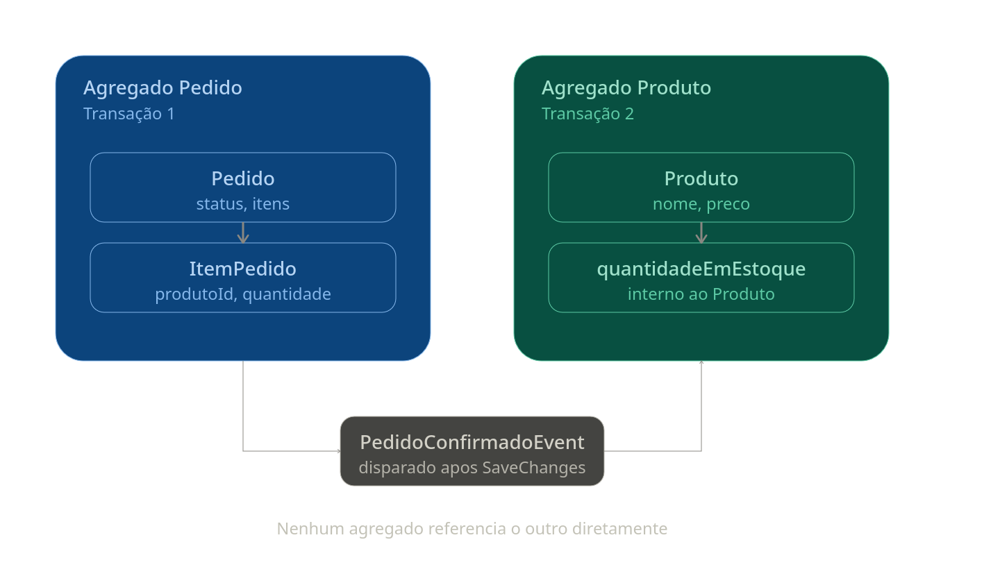

# Domain events

Domain events são um padrão de DDD que representa algo que aconteceu no domínio - e que interessa a outras partes do sistema. A motivação maior é desacoplar os efeitos colateráis da lógica.

## Cenários: Pedido confirmado

Ao fazer uma compra, por exmeplo, teriamos que fazer no código (imperativamente) um trecho para enviar um evento. No entanto, com domain events, podemos `levantar um evento` e interessados (o enviador de email) reage a isso enviando  o email.

Como benefício temos:

* O domínio, a parte do agregado, pelo menos, fica focada nas próprias regras, nao precisa conhecer nada da infraestrutura.
* É facil implementar novos efeitos colaterais de um pedido confirmado com novos handlers

## Implementação

### A base: IDomainEvent e Entity

Precisamos de uma base de Domain event, definido pela interface IDomainEvent:

```cs
public interface IDomainEvent
{
    DateTime OccurredOn {get;}
}

public abstract class DomainEvent: IDomainEvent
{
    public DateTime OccurredOn {get;} = DateTime.UtcNow;
}
```

Na nossa abstraction de `Entity` teremos uma lista de DomainEvents:

```cs
public abstract class Entity
{
    private readonly List<IDomainEvent> _domainEvents = new();

    public IReadOnlyCollection<IDomainEvent> DomainEvents => _domainEvents.AsReadOnly();

    protected void AddDomainEvent(IDomainEvent domainEvent)
        => _domainEvents.Add(domainEvent);

    public void ClearDomainEvents()
        => _domainEvents.Clear();
}
```

### O agregado Pedido

```cs
public class Pedido : Entity
{
    public Guid Id { get; private set; }
    public string Status { get; private set; }
    public List<ItemPedido> Itens { get; private set; } = new();

    public Pedido(Guid id)
    {
        Id = id;
        Status = "Criado";
    }

    public void Confirmar()
    {
        if (Status != "Criado")
            throw new InvalidOperationException("Pedido não pode ser confirmado neste estado.");

        Status = "Confirmado";

        // Aqui está o pulo do gato: em vez de chamar um serviço de e-mail
        // diretamente, o agregado apenas registra que algo aconteceu.
        AddDomainEvent(new PedidoConfirmadoEvent(Id));
    }
}
```

### O evento como contrato

O `Event` é apenas um contrato, que será consumido pelo handler

```cs
public class PedidoConfirmadoEvent : DomainEvent
{
    public Guid PedidoId { get; }

    public PedidoConfirmadoEvent(Guid pedidoId)
    {
        PedidoId = pedidoId;
    }
}
```

### Handler: reagindo ao evento

Para o handler, temos a opção de usar bibliotecas como `MediatR` ou simplesmente implementar a interface do handler e usar DI puro. Vamos considerar sem nenhuma biblioteca por enquanto.

```cs
public interface IDomainEventHandler<TEvent> where TEvent : IDomainEvent
{
    Task Handle(TEvent domainEvent, CancellationToken ct = default);
}
```

Agora podemos implementar quaisquer handlers dada a nossa necessidade, vamos pensar no handler responsável por enviar o email de confirmação

```cs
public class EnviarEmailConfirmacaoHandler : IDomainEventHandler<PedidoConfirmadoEvent>
{
    private readonly IEmailService _emailService;

    public EnviarEmailConfirmacaoHandler(IEmailService emailService)
    {
        _emailService = emailService;
    }

    public async Task Handle(PedidoConfirmadoEvent domainEvent, CancellationToken cancellationToken = default)
    {
        await _emailService.EnviarConfirmacaoAsync(domainEvent.PedidoId);
    }
}
```

Note que o handler apenas orquestra, ele nao tem responsabilidade nenhuma fora isso, ou seja, é o proprio serviço de email que vai lidar com a montagem do html por exemplo (que no futuro poderia implementar outros padrões para evitar que o serviço de email tenha 1000 métodos - talvez um builder para os templates).

### Um segundo handler: atualizando estoque

Agora, vamos pensar na atualização de estoque. Não é responsabilidade do pedido atualizar diretamente o estoque, tanto que não fariam parte nem do mesmo agregado.



Portanto, precisamos de um handler e um evento para isso. Vamos modificar `PedidoConfirmadoEvent` para passar os itens:

```cs
public class PedidoConfirmadoEvent : DomainEvent
{
    public Guid PedidoId { get; }
    public IReadOnlyList<ItemPedidoSnapshot> Itens { get; }

    public PedidoConfirmadoEvent(Guid pedidoId, IReadOnlyList<ItemPedidoSnapshot> itens)
    {
        PedidoId = pedidoId;
        Itens = itens;
    }
}

public record ItemPedidoSnapshot(Guid ProdutoId, int Quantidade);
```

e também modificar a criação do evento lá em `Confirmar()`

```cs
public void Confirmar()
{
    if (Status != "Criado")
        throw new InvalidOperationException("Pedido não pode ser confirmado neste estado.");

    Status = "Confirmado";

    var itensConfirmados = Itens
        .Select(i => new ItemPedidoSnapshot(i.ProdutoId, i.Quantidade))
        .ToList();

    AddDomainEvent(new PedidoConfirmadoEvent(Id, itensConfirmados));
}
```

e finalmente o handler:

```cs
public class AtualizarEstoqueHandler : IDomainEventHandler<PedidoConfirmadoEvent>
{
    private readonly IProdutoRepository _produtoRepository;

    public AtualizarEstoqueHandler(IProdutoRepository produtoRepository)
        => _produtoRepository = produtoRepository;

    public async Task Handle(PedidoConfirmadoEvent domainEvent, CancellationToken cancellationToken = default)
    {
        foreach (var item in domainEvent.Itens)
        {
            var produto = await _produtoRepository.ObterPorIdAsync(item.ProdutoId);
            produto.DebitarEstoque(item.Quantidade);
            await _produtoRepository.SalvarAsync(produto);
        }
    }
}
```

p.s: considere a classe `Produto`

```cs
public class Produto : Entity
{
    public Guid Id { get; private set; }
    public string Nome { get; private set; }
    public decimal Preco { get; private set; }
    public int QuantidadeEmEstoque { get; private set; }

    public Produto(Guid id, string nome, decimal preco, int quantidadeEmEstoque)
        {
    Id = id;
    Nome = nome;
    Preco = preco;
    QuantidadeEmEstoque = quantidadeEmEstoque;
        }

    public void DebitarEstoque(int quantidade)
        {
    if (quantidade <= 0)
    throw new ArgumentException("Quantidade deve ser maior que zero.");

    if (QuantidadeEmEstoque < quantidade)
    throw new InvalidOperationException($"Estoque insuficiente para o produto {Nome}.");

    QuantidadeEmEstoque -= quantidade;
        }
    }
```

### Dispatcher: quem chama os handlers?

A pergunta que talvez fique no momento é, e quem é que chama esses handlers? A reposta é, o dispatcher.

Essa classe será responsavel por receber o evento e descobrir, via DI quais os handlers registrados para esse tipo de evento, chamando todos eles.

Primeiro temos a abstraction:

```cs
public interface IDomainEventDispatcher
{
    Task DispatchAsync(IDomainEvent domainEvent, CancellationToken cancellationToken = default);
}
```

E sua implementação:

```cs
public class DomainEventDispatcher : IDomainEventDispatcher
{
    private readonly IServiceProvider _serviceProvider;

    public DomainEventDispatcher(IServiceProvider serviceProvider)
        => _serviceProvider = serviceProvider;

    public async Task DispatchAsync(IDomainEvent domainEvent, CancellationToken cancellationToken = default)
    {
        var handlerType = typeof(IDomainEventHandler<>).MakeGenericType(domainEvent.GetType());

        // Pega TODOS os handlers registrados pra esse tipo de evento
        var handlers = _serviceProvider.GetServices(handlerType);

        foreach (var handler in handlers)
        {
            var method = handlerType.GetMethod("Handle")!;
            await (Task)method.Invoke(handler, new object[] { domainEvent, cancellationToken })!;
        }
    }
}
```

O ponto chave está em `MakeGenericType`: como o dispatcher recebe um `IDomainEvent`
genérico, ele monta em runtime o tipo fechado correspondente
(`IDomainEventHandler<PedidoConfirmadoEvent>`) e pede pro container de DI todos os
serviços registrados com esse tipo — por isso os dois handlers são chamados, mesmo
o dispatcher nunca tendo referência direta a nenhum dos dois.

## Disparando os eventos

### O Command

Considerando o cenário onde estamos usando CQRS, partimos de um relativo inicio na camada application, o command.

```cs
public class ConfirmarPedidoCommand
{
    public Guid PedidoId { get; set; }
}
```

Command, que por sua vez, tem seu handler (um jeito vertical de pensar em serviços)

```cs
public class ConfirmarPedidoCommandHandler
{
    private readonly IPedidoRepository _repository;
    private readonly AppDbContext _context;

    public ConfirmarPedidoCommandHandler(IPedidoRepository repository, AppDbContext context)
    {
        _repository = repository;
        _context = context;
    }

    public async Task Handle(ConfirmarPedidoCommand command, CancellationToken ct = default)
    {
        var pedido = await _repository.ObterPorIdAsync(command.PedidoId);

        pedido.Confirmar(); // o evento é registrado em memória, ainda não disparado

        await _context.SaveChangesAsync(ct); // aqui, sim, o evento é disparado
    }
}
```

Esse handler, que está em Application (e nao em domain), nada conhece sobre `PedidoConfirmadoEvento`. Muito menos sobre `EnviarEmail...` nem `AtualizarEstoque`. Os disparos finalmente acontecem em `SaveChangesAsync`

### SaveChanges

Aqui o dispatcher entra em ação. Aqui é o lugar ideal pois considerando uma transaction, podemos garantir que os eventos de fato só aconteçam caso a persistencia seja um sucesso.

```cs
public class AppDbContext : DbContext
{
    private readonly IDomainEventDispatcher _dispatcher;

    public AppDbContext(DbContextOptions options, IDomainEventDispatcher dispatcher) : base(options)
    {
        _dispatcher = dispatcher;
    }

    public override async Task<int> SaveChangesAsync(CancellationToken cancellationToken = default)
    {
        // Pega todas as entidades rastreadas que têm domain events pendentes
        var entidadesComEventos = ChangeTracker.Entries<Entity>()
            .Where(e => e.Entity.DomainEvents.Any())
            .Select(e => e.Entity)
            .ToList();

        var result = await base.SaveChangesAsync(cancellationToken);

        // Só dispara depois que a persistência deu certo
        foreach (var entidade in entidadesComEventos)
        {
            var eventos = entidade.DomainEvents.ToList();
            entidade.ClearDomainEvents();

            foreach (var evento in eventos)
                await _dispatcher.DispatchAsync(evento, cancellationToken);
        }

        return result;
    }
}
```

### Registrando no DI

Para que o dispacher consiga fazer as conexões entre events e handlers, precisamos injetar:

```cs
builder.Services.AddScoped<IDomainEventDispatcher, DomainEventDispatcher>();
builder.Services.AddScoped<IDomainEventHandler<PedidoConfirmadoEvent>, EnviarEmailConfirmacaoHandler>();
builder.Services.AddScoped<IDomainEventHandler<PedidoConfirmadoEvent>, AtualizarEstoqueHandler>();
```

E quando um handler falha

O desenvolvedor é ótimo em pensar em caminhos felizes, mas imagine o cenário onde um handler falha:

cs
foreach (var evento in eventos)
    await _dispatcher.DispatchAsync(evento, cancellationToken);

Isso acontece depois do base.SaveChangesAsync() — a persistência do pedido já foi concluída nesse ponto. Se um handler falhar aqui, o pedido já está confirmado no banco, independente do que acontecer nos handlers a seguir.

O primeiro passo é isolar a falha de um handler pra que ela não quebre os outros. Isso deve acontecer no dispatcher:

cs
public async Task DispatchAsync(IDomainEvent domainEvent, CancellationToken cancellationToken = default)
{
    var handlerType = typeof(IDomainEventHandler<>).MakeGenericType(domainEvent.GetType());
    var handlers = _serviceProvider.GetServices(handlerType);

    foreach (var handler in handlers)
    {
        try
        {
            var method = handlerType.GetMethod("Handle")!;
            await (Task)method.Invoke(handler, new object[] { domainEvent, cancellationToken })!;
        }
        catch (Exception ex)
        {
            // Loga o erro, mas não impede os outros handlers de rodar
            _logger.LogError(ex, "Falha ao processar {Handler} para {Evento}", handler.GetType().Name, domainEvent.GetType().Name);
        }
    }
}

Isso resolve a atomicidade entre handlers, mas levanta uma pergunta mais importante: todo efeito colateral deveria estar aqui?

Nem toda ação pertence a um handler pós-commit

Um domain event, por definição, reage a algo que já aconteceu. Ele é o lugar certo pra efeitos que podem falhar e ser reprocessados depois, sem invalidar a ação principal — como o EnviarEmailConfirmacaoHandler: se falhar, o pedido continua válido, só precisamos reenviar o e-mail em algum momento (um worker com retry resolve).

AtualizarEstoqueHandler, do jeito que modelamos, não se encaixa nessa categoria. Se a baixa de estoque falhar, o pedido não deveria ter sido considerado confirmado — mas nesse ponto do fluxo, o SaveChangesAsync já rodou, e é tarde demais pra impedir isso. Um catch que só loga o erro esconde uma inconsistência real: pedido confirmado, estoque não debitado.

A conclusão é que a baixa de estoque nunca deveria ter sido um domain event handler — ela precisa acontecer antes da confirmação ser persistida, na mesma transação. Isso quer dizer trazer essa validação de volta pro ConfirmarPedidoCommandHandler:

cs
public async Task Handle(ConfirmarPedidoCommand command, CancellationToken ct = default)
{
    var pedido = await _repository.ObterPorIdAsync(command.PedidoId);

    // Crítico e bloqueante: acontece ANTES da confirmação.
    // Se falhar aqui, nada foi salvo — o pedido nunca chega a ser confirmado.
    foreach (var item in pedido.Itens)
    {
        var produto = await _produtoRepository.ObterPorIdAsync(item.ProdutoId);
        produto.DebitarEstoque(item.Quantidade);
        await _produtoRepository.SalvarAsync(produto);
    }

    pedido.Confirmar();

    await _context.SaveChangesAsync(ct); // Pedido e Produto salvos juntos, ou nenhum dos dois
}

AtualizarEstoqueHandler deixa de existir como domain event handler — a regra virou parte do próprio Command.

O que sobra pro domain event, então?

Isso não invalida o padrão, só delimita melhor onde ele se encaixa: domain events servem pra efeitos que podem acontecer depois, de forma independente, sem invalidar a ação principal. E-mail é um bom exemplo. Outro seria publicar um evento de integração pra outro sistema — avisar o time de logística que o pedido está pronto pra separação, por exemplo. Isso é importante (não queremos perder), mas não é motivo pra desconfirmar um pedido se falhar — é candidato natural pro padrão Outbox, que garante entrega com retry sem bloquear a transação principal.

A regra prática que fica: se um "efeito colateral" pode invalidar a ação principal, ele não é colateral — é parte da própria transação.