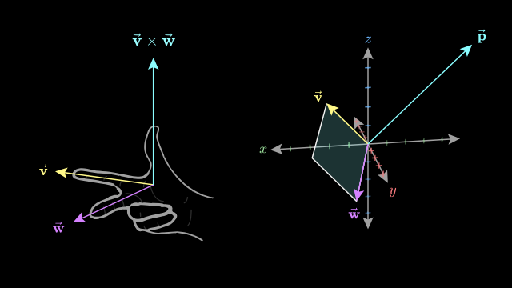

# Cross Product

Em duas dimensões, temos o cross product definido como a área gerada por dois vetores. 

<svg width="200" height="200" viewBox="0 0 100 100">
  <line x1="0" y1="90" x2="90" y2="90" stroke="gray" stroke-width="1" />
  <line x1="10" y1="100" x2="10" y2="10" stroke="gray" stroke-width="1" />
  
  <line x1="10" y1="90" x2="10" y2="50" stroke="red" stroke-width="2" marker-end="url(#arrowx)" />
  <defs>
    <marker id="arrowx" viewBox="0 0 10 10" refX="5" refY="5" markerWidth="6" markerHeight="6" orient="auto-start-reverse">
      <path d="M 0 0 L 10 5 L 0 10 z" fill="red" />
    </marker>
    <marker id="arrowj" viewBox="0 0 10 10" refX="5" refY="5" markerWidth="6" markerHeight="6" orient="auto-start-reverse">
      <path d="M 0 0 L 10 5 L 0 10 z" fill="blue" />
    </marker>
  </defs>
  <text x="15" y="45" fill="red" font-size="8">ĵ</text>

  <line x1="10" y1="90" x2="50" y2="90" stroke="blue" stroke-width="2" marker-end="url(#arrowj)" />
    <text x="45" y="100" fill="blue" font-size="8">î</text>
 <polygon points="10,90 50,90 50,50 10,50" fill="purple" fill-opacity="0.2" stroke="purple" stroke-width="0.5" stroke-dasharray="2" />

</svg>

Definimos o cross product de dois vetores $\vec{a} = (a_x, a_y)$ e $\vec{b} = (b_x, b_y)$ como:
$$\vec{a} \times \vec{b} = a_x b_y - a_y b_x$$

ou, de forma equivalente, como a área do paralelogramo formado pelos vetores $\vec{a}$ e $\vec{b}$:
$$\vec{a} \times \vec{b} = |\vec{a}| |\vec{b}| \sin(\theta)$$
onde $\theta$ é o ângulo entre os vetores $\vec{a}$ e $\vec{b}$.

Também precisamos pensar na orientação do cross product. Se o resultado for positivo, significa que $\vec{b}$ está à esquerda de $\vec{a}$ (sentido anti-horário). Se for negativo, $\vec{b}$ está à direita de $\vec{a}$ (sentido horário). Se for zero, os vetores são colineares.

## Relação com o determinante
O determinante de uma matriz 2x2 formada pelos vetores $\vec{a}$ e $\vec{b}$ é exatamente o cross product:
$$\text{det}\begin{pmatrix} a_x & a_y \\ b_x & b_y \end{pmatrix} = a_x b_y - a_y b_x = \vec{a} \times \vec{b}$$

Isso se dá por que o cross product pode ser interpretado como uma transformação linear que movê os vetores da base canônica para a base formada por $\vec{a}$ e $\vec{b}$. O determinante mede a escala dessa transformação, que é exatamente a área do paralelogramo formado pelos vetores (na base canonica).

# Cross product em 3D
O que fizemos até agora em 2d não é exatamente o cross product tradicional, mas sim uma versão simplificada. O cross product tradicional é definido em 3D e resulta em um vetor perpendicular aos dois vetores originais.

Isso é, por definição, um cross product pega dois vetores 3d e retornam um vetor 3d perpendicular a ambos. A magnitude do vetor resultante é igual à área do paralelogramo formado pelos dois vetores originais, e a direção é dada pela regra da mão direita.

Podemos calcular o cross product de dois vetores $\vec{a} = (a_x, a_y, a_z)$ e $\vec{b} = (b_x, b_y, b_z)$ usando a seguinte fórmula:
$$\vec{a} \times \vec{b} = (a_y b_z - a_z b_y, a_z b_x - a_x b_z, a_x b_y - a_y b_x)$$

Ou, usando uma técnica, calcular o determinante de uma matriz 3x3:
$$\begin{vmatrix} v_1 \\ v_2 \\ v_3 \end{vmatrix} \times \begin{vmatrix}
    w_1 \\ w_2 \\ w_3 \end{vmatrix} = \begin{vmatrix}
    \hat{i} & \hat{j} & \hat{k} \\
    v_1 & v_2 & v_3 \\
    w_1 & w_2 & w_3 \end{vmatrix}$$
    
    

# Cross products em visão de transformações lineares

Se trabalharmos com a notação de determinante, usando $\hat{i}$, $\hat{j}$ e $\hat{k}$ temos:

$$\begin{bmatrix} v_1 \\ v_2 \\ v_3 \end{bmatrix} \times \begin{bmatrix} w_1 \\ w_2 \\ w_3 \end{bmatrix} = \det \left( \begin{bmatrix} \hat{i} & v_1 & w_1 \\ \hat{j} & v_2 & w_2 \\ \hat{k} & v_3 & w_3 \end{bmatrix} \right)$$

O que nos leva a:
$$\hat{i}(v_2 w_3 - v_3 w_2) - \hat{j}(v_1 w_3 - v_3 w_1) + \hat{k}(v_1 w_2 - v_2 w_1)$$

Podemos interpretar o cross product como uma matrix de incognitas 1x3 multiplicada pelo vetor $\vec{u} = [x,y,z]^T$:

$$\begin{bmatrix} ? & ? & ? \end{bmatrix} \begin{bmatrix}
    x \\
    y \\
    z  \end{bmatrix}
    =
    \text{det} \left( \begin{bmatrix} x & v_1 & w_1 \\ y & v_2 & w_2 \\ z & v_3 & w_3 \end{bmatrix} \right)$$
    $$

ou, pensando em dot products, um vetor $vec{p}$ multiplicado por um vetor de incognitas $vec{u}$:
$$\vec{p} \cdot \vec{u} = \text{det} \left( \begin{bmatrix} x & v_1 & w_1 \\ y & v_2 & w_2 \\ z & v_3 & w_3 \end{bmatrix} \right)$$

O que nos resultaria em
$$ (\text{something}) \cdot x + (\text{something}) \cdot y + (\text{something}) \cdot z$$

Esses somethings são coordenadas do vetor $\vec{p}$, e o resultado é o cross product, obtido pelo calculo de determinante.

$$(v_2 w_3 - v_3 w_2) \cdot x + (v_3 w_1 - v_1 w_3) \cdot y + (v_1 w_2 - v_2 w_1) \cdot z = p_1 \cdot x_1 + p_2 \cdot y + p_3 \cdot z$$

E portanto
$$ p_1 = v_2 w_3 - v_3 w_2$$
$$ p_2 = v_3 w_1 - v_1 w_3$$
$$ p_3 = v_1 w_2 - v_2 w_1$$