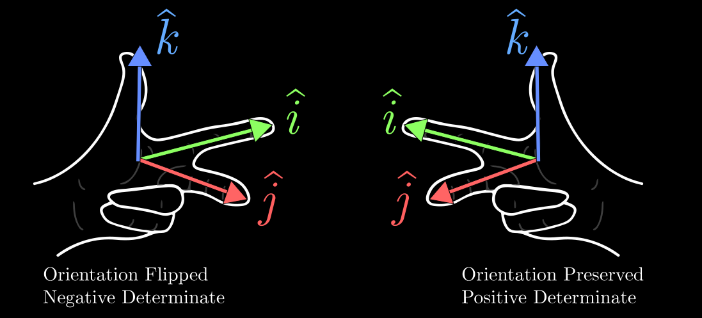
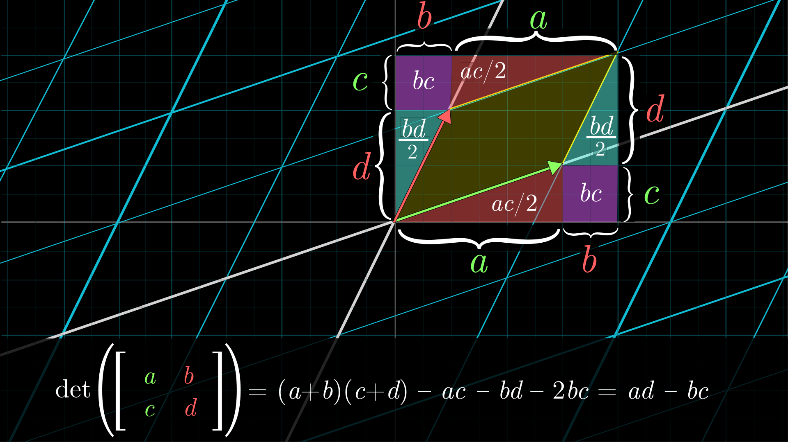

# Determinantes

Um jeito ingênuo de pensar sobre determinantes é pensar neles como a área ou o volume de um paralelogramo ou paralelepípedo formado pelos vetores coluna de uma matriz.

$$\begin{bmatrix} 1 &1  \\ 0 & 1 \end{bmatrix}$$

Teriamos uma área $1*1 - 0*1 = 1$.

O determinante, de acordo com essa noção, é, portanto, um fator de escala para a transformação linear representada pela matriz. 

Uma determinante é zero se ela espreme o espaço vetorial em uma linha ou ponto.

## Determinante permite valores negativos

Se pensamos a matriz $A = \begin{bmatrix} î_1 & ĵ_1 \\ î_2 & ĵ_2 \end{bmatrix}$, onde $\mathbf{v}_1 = (î_1, î_2)$ e $\mathbf{v}_2 = (ĵ_1, ĵ_2)$ são os vetores coluna de $A$, o determinante de $A$ é dado por:
$$\text{det}(A) = î_1 \cdot ĵ_2 - î_2 \cdot ĵ_1$$   

O determinante resultará em negativo, se a orientação dos vetores $\mathbf{v}_1$ e $\mathbf{v}_2$ tiverem se invertido. Isso é, antes de $T$ o vetor $î$ estava à esquerda de $ĵ$, e depois de $T$ o vetor $î$ está à direita de $ĵ$. Nesse cenário, o determinante de $A$ será negativo, indicando que a transformação linear representada por $A$ inverteu a orientação do espaço vetorial.

## Determinante em R³

O determinante de uma matriz 3x3, que representa uma transformação linear em $\mathbb{R}^3$, pode ser interpretado como o volume do paralelepípedo formado pelos vetores coluna da matriz.

## Calculando determinantes

### Para matrizes 2x2

Para matrizes 2x2, o determinante é calculado usando a fórmula:
$$\text{det}\begin{bmatrix} a & b \\ c & d \end{bmatrix} = ad - bc$$

### Para matrizes 3x3
Podemos pensar em uma matriz 3x3 e decompola em três matrizes 2x2:

$$\begin{bmatrix} a & b & c \\ d & e & f \\ g & h & i \end{bmatrix}$$

$$ = a \cdot \text{det}\begin{bmatrix} e & f \\ h & i \end{bmatrix} - b \cdot \text{det}\begin{bmatrix} d & f \\ g & i \end{bmatrix} + c \cdot \text{det}\begin{bmatrix} d & e \\ g & h \end{bmatrix}$$

Podemos também usar a regra de Sarrus, que é um método visual para calcular o determinante de uma matriz 3x3. Para aplicar a regra de Sarrus, você escreve os elementos da matriz 3x3 e depois repete as duas primeiras colunas à direita da matriz. Em seguida, você soma os produtos das diagonais descendentes (da esquerda para a direita) e subtrai os produtos das diagonais ascendentes (da direita para a esquerda).

$$\text{det}\begin{bmatrix} a & b & c \\ d & e & f \\ g & h & i \end{bmatrix} = (aei + bfg + cdh) - (ceg + bdi + afh)$$

