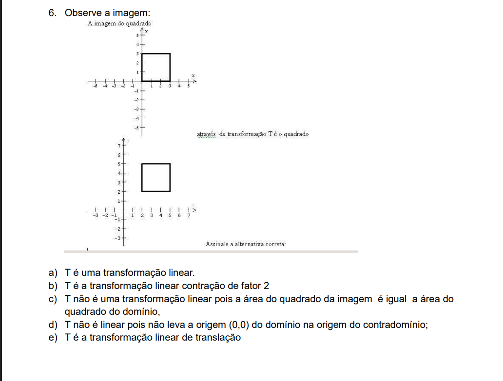

1. Verifique se $T :R²$, dada por $T(x,y) = (x, + y,1)$ é linear.

**Não.**

Uma vez que uma transformação linear deve carregar o vetor nulo para o vetor nulo, ou seja, $T(0,0) = (0,0,0)$, mas nesse caso $T(0,0) = (0,0,1)$, o que não é o vetor nulo em $R^3$. Portanto, $T$ não é linear.

Se quisermos mais rigor, precisamos checar as propriedades de aditividade e homogeneidade:
i. Aditividade ($T(u + v) = T(u) + T(v)$):
Sejam $u = (x_1, y_1)$ e $v = (x_2, y_2)$, então:
$$T(u + v) = T(x_1 + x_2, y_1 + y_2) = (x_1 + x_2, y_1 + y_2, 1)$$
$$T(u) + T(v) = (x_1, y_1, 1) + (x_2, y_2, 1) = (x_1 + x_2, y_1 + y_2, 2)$$
Como $T(u + v) \neq T(u) + T(v)$, a propriedade de aditividade não é satisfeita.

ii. Homogeneidade ($T(cv) = cT(v)$):
Seja $v = (x, y)$ e $c$ um escalar, então:
$$T(cv) = T(cx, cy) = (cx, cy, 1)$$
$$cT(v) = c(x, y, 1) = (cx, cy, c)$$
Como $T(cv) \neq cT(v)$, a propriedade de homogeneidade também não é satisfeita.

2. Verifique se a aplicação $T:R² \to R³$, dada por $T(x,y) = (3xm-2y,x-y)$ é linear.

Para checar se a aplicação $T$ é linear, precisamos verificar as propriedades de aditividade e homogeneidade.

i. Aditividade:
Sejam $u = (x_1, y_1)$ e $v = (x_2, y_2)$, então:
$$ T(u+v) = T(u) + T(v)$$
Substituindo o lado esquerdo:
$$ T(x_1 + x_2, y_1 + y_2) = (3(x_1+x_2), -2(y_1+y_2), - (y_1+y_2))$$

Substituindo o lado direito:
$$ T(u) + T(v) = (3x_1 - 2y_1, x_1 - y_1) + (3x_2 - 2y_2, x_2 - y_2) = (3x_1 + 3x_2 - 2y_1 - 2y_2, x_1 + x_2 - y_1 - y_2)$$
Fatorando:
$$ T(u) + T(v) = (3(x_1 + x_2) - 2(y_1 + y_2), (x_1 + x_2) - (y_1 + y_2))$$
Comparando os dois lados, vemos que:
$$ T(u+v) = T(u) + T(v)$$
Portanto, a propriedade de aditividade é satisfeita.

ii. Homogeneidade, representada por $T(cv) = cT(v)$:
Seja $v = (x, y)$ e $c$ um escalar, e dada a homogeneidade, temos

Substituindo o lado esquerdo:
$$ T(cv) = T(cx, cy) = (3(cx), -2(cy), cx - cy) = (3cx, -2cy, cx - cy)$$

Substituindo o lado direito:
$$ cT(v) = c(3x - 2y, x - y) = (3cx - 2cy, cx - cy)$$
Comparando os dois lados, vemos que:
$$ T(cv) = cT(v)$$
Portanto, a propriedade de homogeneidade também é satisfeita.

Como ambas as propriedades de aditividade e homogeneidade são satisfeitas, concluímos que a aplicação $T$ é linear.

###  3. Qual é a imagen di vetir (1,3,2) pela aplicação $F:R³ \to R²$ dada por $F(x,y,z) = (x+z,2y)$?

Basta aplicar a função $F$ ao vetor $(1,3,2)$:
$$F(1,3,2) = (1 + 2, 2 \cdot 3) = (3, 6)$$
Portanto, a imagem do vetor $(1,3,2)$ pela aplicação $F$ é o vetor $(3, 3)$.

### 4. A imagem do vetor (1,3,2) pela transformação linear $T:R³ \to R²$, $T(x,y,z) = (x+z, y)$ é?
Basta aplicar a função $T$ ao vetor $(1,3,2)$:
$$T(1,3,2) = (1 + 2, 3) = (3, 3)$$
Portanto, a imagem do vetor $(1,3,2)$ pela transformação linear $T$ é o vetor $(3, 3)$.

### 5. A imagem do vetor (2,-1) pela transformação linear $T:R² \to R³$$, T(x,y) = (x+y, y-x, 2x+3y)$ eh?

Basta aplicar a função $T$ ao vetor $(2,-1)$:
$$T(2,-1) = (2 + (-1), -1 - 2, 2 \cdot 2 + 3 \cdot (-1)) = (1, -3, 1)$$
Portanto, a imagem do vetor $(2,-1)$ pela transformação linear $T$ é o vetor $(1, -3, 1)$.

### 6.

### 7. Um retangulo ABCD com coordenadas A(0,0); B(2,0); C(2,3) e D(0,3) e a transformação linear T(x,y) = (x+1, y-1) terá a imagem dada por:

Para encontrar a imagem do retângulo ABCD sob a transformação linear $T$, precisamos aplicar a função $T$ a cada um dos vértices do retângulo.

1. Isso é uma transformação linear? Não, porque $T(0,0) = (1,-1)$, que não é o vetor nulo. Portanto, $T$ não é linear.
Mas considerando a transformação $T$ como uma transformação afim, podemos calcular a imagem dos vértices:
- Para o vértice A(0,0):
$$T(0,0) = (0 + 1, 0 - 1) = (1, -1)$$
- Para o vértice B(2,0):
$$T(2,0) = (2 + 1, 0 - 1) = (3, -1)$$
- Para o vértice C(2,3):
$$T(2,3) = (2 + 1, 3 - 1) = (3, 2)$$
- Para o vértice D(0,3):
$$T(0,3) = (0 + 1, 3 - 1) = (1, 2)$$

Portanto, a imagem do retângulo ABCD sob a transformação $T$ é o quadrilátero formado pelos pontos (1, -1), (3, -1), (3, 2) e (1, 2).

### 8. A imagem do vetor (-3, 5, 1) pela transformação linear T: R3 → R3, T (x, y, z) = (x + y, 2x -z, z -2y) é: 
Basta aplicar a função $T$ ao vetor $(-3, 5, 1)$:
$$T(-3, 5, 1) = (-3 + 5, 2 \cdot (-3) - 1, 1 - 2 \cdot 5) = (2, -7, -9)$$
Portanto, a imagem do vetor $(-3, 5, 1)$ pela transformação linear $T$ é o vetor $(2, -7, -9)$.

A matriz $A$ de uma transformação $T: \mathbb{R}^3 \to \mathbb{R}^3$ será uma matriz $3 \times 3$ onde cada linha corresponde a uma das funções de saída.Passo a passo para montar a matrizDada a transformação $T(x, y, z) = (x + y, 2x - z, z - 2y)$:Primeira componente: $x + y$Coeficiente de $x$: 1Coeficiente de $y$: 1Coeficiente de $z$: 0 (ele não aparece)Linha 1: $\begin{bmatrix} 1 & 1 & 0 \end{bmatrix}$Segunda componente: $2x - z$Coeficiente de $x$: 2Coeficiente de $y$: 0Coeficiente de $z$: -1Linha 2: $\begin{bmatrix} 2 & 0 & -1 \end{bmatrix}$Terceira componente: $z - 2y$ (Cuidado com a ordem!)Coeficiente de $x$: 0Coeficiente de $y$: -2Coeficiente de $z$: 1Linha 3: $\begin{bmatrix} 0 & -2 & 1 \end{bmatrix}$A Matriz CanônicaJuntando tudo, a matriz associada à transformação é:$$[T] = \begin{bmatrix} 1 & 1 & 0 \\ 2 & 0 & -1 \\ 0 & -2 & 1 \end{bmatrix}$$

### 9. Sendo T(x, y) = (-3x, 2y) uma transformação linear, determine a imagem de um triângulo cujos vértices estão em A (0, 0); B (3, 0); C (4, 1)

Para determinar a imagem do triângulo formado pelos vértices A, B e C sob a transformação linear $T(x, y) = (-3x, 2y)$, precisamos aplicar a função $T$ a cada um dos vértices do triângulo.

1. Para o vértice A(0, 0):
$$T(0, 0) = (-3 \cdot 0, 2 \cdot 0) = (0, 0)$$
2. Para o vértice B(3, 0):
$$T(3, 0) = (-3 \cdot 3, 2 \cdot 0) = (-9, 0)$$
3. Para o vértice C(4, 1):
$$T(4, 1) = (-3 \cdot 4, 2 \cdot 1) = (-12, 2)$$

Para encontrar a matriz, pegamos:

* -3x
Temos que  [-3  0]
* 2y
Temos que  [0  2]

Juntando tudo, a matriz associada à transformação é:$$[T] = \begin{bmatrix} -3 & 0 \\ 0 & 2 \end{bmatrix}$$ 

### 10. Se T1: R2 →R3  e T2: R2 →R3 são transformações lineares definidas por T1 (x, y) = (x + 2y, 2x -y, x) e T2 (x, y) = (-x, y, x + y), então T1 + T2 é definida por: 

Para encontrar a transformação $T1 + T2$, precisamos somar as imagens de $T1$ e $T2$ para cada vetor $(x, y)$.

1. Para a primeira componente:
$$T1(x, y) = (x + 2y, 2x - y, x)$$
$$T2(x, y) = (-x, y, x + y)$$
Somando as primeiras componentes:
$$T1(x, y) + T2(x, y) = (x + 2y) + (-x) = 2y$$
2. Para a segunda componente:
$$T1(x, y) + T2(x, y) = (2x - y) + y = 2x$$
3. Para a terceira componente:
$$T1(x, y) + T2(x, y) = x + (x + y) = 2x + y$$
Portanto, a transformação $T1 + T2$ é definida por:
$$T1 + T2 (x, y) = (2y, 2x, 2x + y)$$

Poderiamos também montar a matriz associada a cada transformação e somar as matrizes para obter a matriz de $T1 + T2$:
Matriz de $T1$:
$$[T1] = \begin{bmatrix} 1 & 2 \\ 2 & -1 \\ 1 & 0 \end{bmatrix}$$
Matriz de $T2$:
$$[T2] = \begin{bmatrix} -1 & 0 \\ 0 & 1 \\ 1 & 1 \end{bmatrix}$$
Somando as matrizes:
$$[T1 + T2] = [T1] + [T2] = \begin{bmatrix} 1 & 2 \\ 2 & -1 \\ 1 & 0 \end{bmatrix} + \begin{bmatrix} -1 & 0 \\ 0 & 1 \\ 1 & 1 \end{bmatrix} = \begin{bmatrix} 0 & 2 \\ 2 & 0 \\ 2 & 1 \end{bmatrix}$$
Essa matriz corresponde à transformação $T1 + T2$ que encontramos anteriormente, confirmando que $T1 + T2 (x, y) = (2y, 2x, 2x + y)$.   

### 11.  Se T1: R2→R3 e T2: R2→R3 são transformações lineares definidas por T1 (x, y) = (x + 2y, 2x -y, x) e T2 (x, y) = (-x, y, x + y), então 3T1 -2T2. é definida por: 

Para encontrar a transformação $3T1 - 2T2$, precisamos multiplicar a transformação $T1$ por 3 e a transformação $T2$ por 2, e depois subtrair os resultados.

1. Multiplicando $T1$ por 3:
$$3T1(x, y) = 3(x + 2y, 2x - y, x) = (3x + 6y, 6x - 3y, 3x)$$
2. Multiplicando $T2$ por 2:
$$2T2(x, y) = 2(-x, y, x + y) = (-2x, 2y, 2x + 2y)$$
3. Subtraindo os resultados:
$$3T1 - 2T2 (x, y) = (3x + 6y, 6x - 3y, 3x) - (-2x, 2y, 2x + 2y)$$
$$= (3x + 6y + 2x, 6x - 3y - 2y, 3x - 2x - 2y)$$
$$= (5x + 6y, 6x - 5y, x - 2y)$$
Portanto, a transformação $3T1 - 2T2$ é definida por:
$$3T1 - 2T2 (x, y) = (5x + 6y, 6x - 5y, x - 2y)$$

No entanto, poderiamos também montar a matriz associada a cada transformação, multiplicar as matrizes pelos respectivos escalares e depois subtrair as matrizes para obter a matriz de $3T1 - 2T2$:
Matriz de $T1$:
$$[T1] = \begin{bmatrix} 1 & 2 \\
2 & -1 \\
1 & 0 \end{bmatrix}$$

Matriz de $T2$:
$$[T2] = \begin{bmatrix} -1 & 0 \\
0 && 1 \\
1 & 1 \end{bmatrix}$$

Multiplicando as matrizes pelos escalares:
$$3[T1] = 3 \begin{bmatrix} 1 & 2 \\
2 & -1 \\
1 & 0 \end{bmatrix} = \begin{bmatrix} 3 & 6 \\
6 & -3 \\
3 & 0 \end{bmatrix}$$
$$2[T2] = 2 \begin{bmatrix} -1 & 0 \\
0 & 1 \\
1 & 1 \end{bmatrix} = \begin{bmatrix} -2 & 0 \\
0 & 2 \\
2 & 2 \end{bmatrix}$$

Subtraindo as matrizes:
$$3[T1] - 2[T2] = \begin{bmatrix} 3 & 6 \\
6 & -3 \\
3 & 0 \end{bmatrix} - \begin{bmatrix} -2 & 0 \\
0 & 2 \\
2 & 2 \end{bmatrix} = \begin{bmatrix} 5 & 6 \\
6 & -5 \\
1 & -2 \end{bmatrix}$$

23. Considere as transformações lineares 𝐹: ℝଶ → ℝଶ
 e 𝐺: ℝଷ → ℝଶ
 dados por
𝐹(𝑥, 𝑦) = (𝑥, 𝑥 − 𝑦) e 𝐺(𝑥, 𝑦, 𝑧) = (𝑥 + 𝑦, 2𝑧). Determine, se possível, as compostas abaixo:
a) 𝐹 ∘ 𝐺
b) 𝐺 ∘ 𝐹

a) Para determinar a composição $F \circ G$, precisamos aplicar a transformação $G$ primeiro e depois aplicar a transformação $F$ ao resultado.

1. Aplicando $G$ a um vetor $(x, y, z)$:
$$G(x, y, z) = (x + y, 2z)$$
2. Agora, aplicamos $F$ ao resultado de $G$:
$$F(G(x, y, z)) = F(x + y, 2z) = ((x + y), (x + y) - 2z)$$
Portanto, a composição $F \circ G$ é dada por:
$$F \circ G (x, y, z) = ((x + y), (x + y) - 2z)$$

b) Não é possível determinar a composição $G \circ F$ porque a transformação $F$ mapeia vetores de $\mathbb{R}^2$ para $\mathbb{R}^2$, enquanto a transformação $G$ espera vetores de $\mathbb{R}^3$ como entrada. Portanto, não podemos aplicar $G$ diretamente ao resultado de $F$, já que eles operam em espaços de dimensões diferentes. Em notações conjuntisticas, o domínio de $F$ é $\mathbb{R}^2$ e o contradomínio de $G$ é $\mathbb{R}^2$, mas o domínio de $G$ é $\mathbb{R}^3$. Assim, a composição $G \circ F$ não é definida.