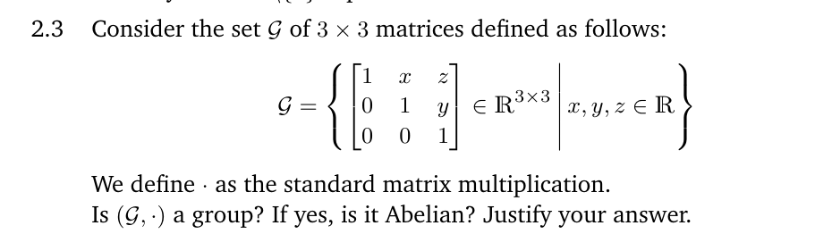
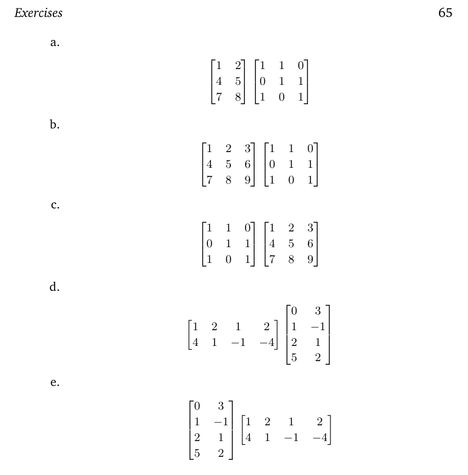

Para $(G,\cdot)$ ser um grupo, precisamos verificar as seguintes propriedades:
1. **Fechamento**: Para todo $a, b \in G$, o resultado da operação $a \cdot b$ também deve estar em $G$.
2. **Associatividade**: Para todo $a, b, c \in G$, deve valer $(a \cdot b) \cdot c = a \cdot (b \cdot c)$.
3. **Elemento Neutro**: Deve existir um elemento $e \in G$ tal que para todo $a \in G$, $e \cdot a = a \cdot e = a$.
4. **Elemento Inverso**: Para cada elemento $a \in G$, deve existir um elemento $a^{-1} \in G$ tal que $a \cdot a^{-1} = a^{-1} \cdot a = e$.

O fechamento é respeitado, já que 
$$A \cdot B = \begin{bmatrix} 1 & x_1+x_2 & z_2+x_1y_2+z_1 \\ 0 & 1 & y_1+y_2 \\ 0 & 0 & 1 \end{bmatrix}$$
e sendo $x_1+x_2, y_1+y_2, z_2+x_1y_2+z_1 \in \mathbb{R}$, o resultado da operação está em $G$.

A associatividade é garantida pela associatividade da multiplicação de matrizes. O elemento neutro é a matriz identidade
$$e = \begin{bmatrix} 1 & 0 & 0 \\ 0 & 1 & 0 \\ 0 & 0 & 1 \end{bmatrix}$$

Precisamos agora verificar a existência do elemento inverso. Para isso, precisamos encontrar uma matriz $A^{-1}$ tal que $A \cdot A^{-1} = e$. Seja
$$A^{-1} = \begin{bmatrix} 1 & -x_1 & x_1y_1 - z_1 \\ 0 & 1 & -y_1 \\ 0 & 0 & 1 \end{bmatrix}$$

Portanto, $(G,\cdot)$ é um grupo.

Para verificar que $(G,\cdot)$ é um grupo abeliano, precisamos verificar se a operação é comutativa, ou seja, se $A \cdot B = B \cdot A$ para todo $A, B \in G$. Calculando $B \cdot A$, temos
$$B \cdot A = \begin{bmatrix} 1 & x_2+x_1 & z_1+x_2y_1+z_2 \\ 0 & 1 & y_2+y_1 \\ 0 & 0 & 1 \end{bmatrix}$$
Comparando com $A \cdot B$, vemos que $A \cdot B \neq B \cdot A$ devido ao termo $z_2+x_1y_2+z_1$ em $A \cdot B$ e $z_1+x_2y_1+z_2$ em $B \cdot A$. Portanto, a operação não é comutativa e $(G,\cdot)$ não é um grupo abeliano.

_____

1/0/7 + 4/5/0 + 0/8/9 = 5/13/16