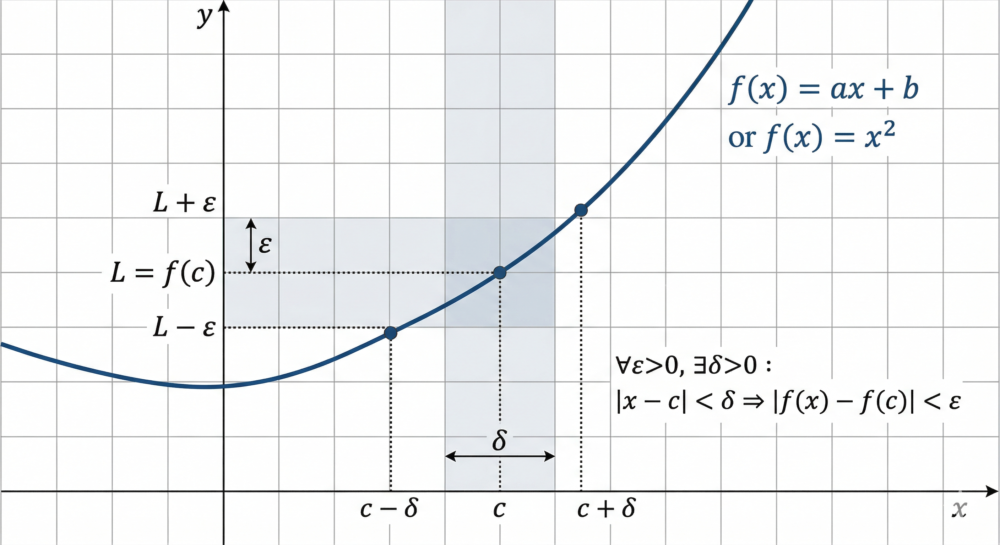

# Limite

A diferença entre limite e continuidade é que o sobre o que acontece no exato ponto $c$ da função.

O limite é sobre o comportamento da função quando $x$ se aproxima de $c$, mas não necessariamente em $c$ (se aproxima sem nunca tocar).

Já a continuidade é sobre o comportamento da função exatamente em $c$.

## Definição

Lembrando da definição de continuidade:

$$\forall \epsilon > 0, \exists \delta > 0 : |x - c| < \delta \implies |f(x) - f(c)| < \epsilon$$

A definição de limite é similar, mas ao invés de $f(c)$, temos um valor $L$ que representa o limite da função quando $x$ se aproxima de $c$:

$$\forall \epsilon > 0, \exists \delta > 0 : 0 < |x - c| < \delta \implies |f(x) - L| < \epsilon$$

As diferenças principais são:
- No limite existe o $0 < |x - c|$ para garantir que estamos nos aproximando de $c$ mas sem tocar em $c$.
- No limite, o valor que queremos que $f(x)$ se aproxime é $L$, que pode ser diferente de $f(c)$, enquanto na continuidade queremos que $f(x)$ se aproxime de $f(c)$.

## Unicidade do limite

Teorema: Se o limite de $f(x)$ quando $x$ se aproxima de $c$ existe, então ele é único.

Ou seja, não é possivel que uma função tenda a dois valores diferentes ao mesmo tempo no mesmo ponto. Se você encontrar o limite pela esquerda $L_1$ e pela direita $L_2$, e eles forem diferentes, então o limite não existe.

### Prova por ab absurdo

Suponha $\lim_{x \to c} f(x) = L_1$ e $\lim_{x \to c} f(x) = L_2$ com $L_1 \neq L_2$.$

Escolha um $\epsilon$ tal que $0 < \epsilon < \frac{|L_1 - L_2|}{2}$.

## Limites fora do domínio
Para calcularmos o limite em c, o ponto $c$ precisa ser um ponto de acumulação do domínio da função, ou seja, precisa existir uma sequência de pontos dentro do domínio que se aproximam de $c$.

Considere a função:$$f(x) = \frac{x^2 - 1}{x - 1}$$Domínio: $x \in \mathbb{R}, x \neq 1$. 

O ponto $c=1$ está fora do domínio (causa divisão por zero).

Cálculo do Limite:$$\lim_{x \to 1} \frac{(x-1)(x+1)}{x-1} = \lim_{x \to 1} (x+1) = 2$$Conclusão: O limite existe e é $2$, embora a função "não exista" no ponto $x=1$. No gráfico, isso aparece como um "furo" (ou lacuna removível).